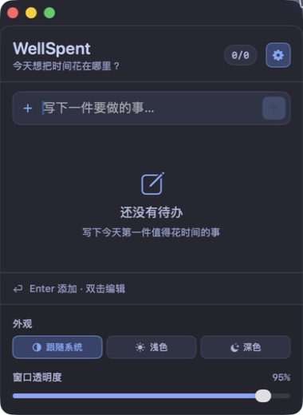

# WellSpent

> 置顶浮动的 Tokyo Night 待办小窗 · a focused floating todo app for macOS

一个一直飘在屏幕角落的小窗口，提醒你今天该做什么。写进去、做完了、划掉，一天就有了形状。

<p align="center">
  
</p>

## 核心特性

- 🪟 **置顶浮动** — 始终在所有窗口之上，随时看得到
- 🖱️ **可拖动** — 点背景随便拖到哪个角落
- 👻 **透明度可调** — 30%–100% 自由调，不挡事
- 🌃 **Tokyo Night 视觉** — 以夜间与 Light 调色板为基础，清晰区分内容、状态与操作
- 🌓 **三档外观** — 可跟随 macOS，也可手动固定浅色或深色
- 💾 **本地持久化** — 数据保存在 `~/Library/Application Support/WellSpent/`，不会联网

## 使用

- 回车 / 点输入框右侧箭头 — 添加待办
- 点复选框 — 完成 / 取消完成
- 双击文字 — 编辑
- 点垃圾桶 — 删除
- 点标题右侧齿轮 — 选择外观模式或调整透明度

## 安装

### 方式一：下载 DMG（推荐）

到 [Releases](../../releases) 下载最新版 DMG，双击打开，把 `WellSpent.app` 拖进 Applications。

> ⚠️ 未代码签名。首次启动会被 Gatekeeper 拦，解决办法：**右键点 app 图标 → 选「打开」→ 弹窗里再点一次「打开」**。之后正常双击即可。

### 方式二：从源码构建

需要 macOS 13+ 和 Xcode Command Line Tools。

下载或克隆本仓库后，在项目根目录运行：

```bash
./WellSpent/scripts/build.sh
open "WellSpent/build/WellSpent.app"
```

打包 DMG：

```bash
./WellSpent/scripts/package-dmg.sh           # 默认 1.0.0
./WellSpent/scripts/package-dmg.sh 1.0.1     # 指定版本号
```

## 技术栈

- SwiftUI + AppKit (NSApplicationDelegate 配置 NSWindow)
- Foundation + Combine (JSON 持久化 + 防抖保存)
- 零第三方依赖
- 直接 `swiftc` 编译 + 手动组装 `.app` bundle（不依赖 Xcode 项目文件）

## 视觉系统

界面以 Tokyo Night 的蓝紫夜色和低干扰层级为基础；浅色模式使用 Tokyo Night Light 的对应色值，而不是简单反相。活动任务保持高对比，完成状态退居次要层级，蓝色只用于当前操作和选中状态，绿色与红色分别表达完成与删除。

外观选择与待办数据均保存在本机 `~/Library/Application Support/WellSpent/`，不会上传到网络。

## 灵感来源

WellSpent 基于 [今天没白活](https://github.com/lijigang/JintianMeiBaihuo) 修改，并在此基础上重新设计了视觉主题、外观模式、应用名称、图标与项目结构。

## License

MIT © 2026 Howell · Scott · Stark
